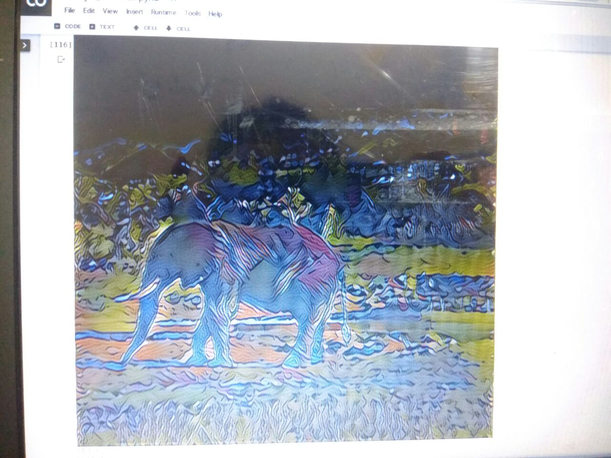

# Neural_style_transfer
An implementation of [neural style][paper] in TensorFlow.
Presentation of [neural style][ppt].

Style transfer is the technique of recomposing images in the style of other images.
## Dependencies

    tensorflow
    matplotlib
    python 3
    
## Examples
    
    
    
    
    
  

[paper]: http://arxiv.org/pdf/1508.06576v2.pdf
[ppt]: https://docs.google.com/presentation/d/1Rs_saCe34Qdvh1XzIGdLpRavNaartBZHIy3VcZCDTBs/edit?usp=sharing
