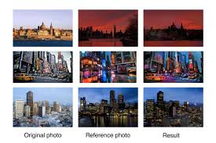
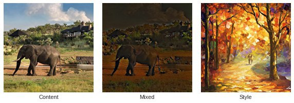
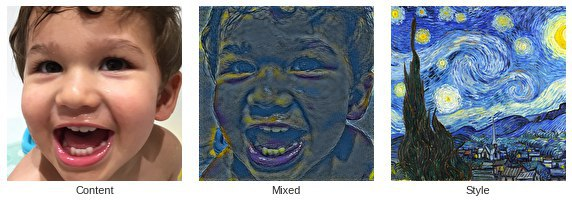
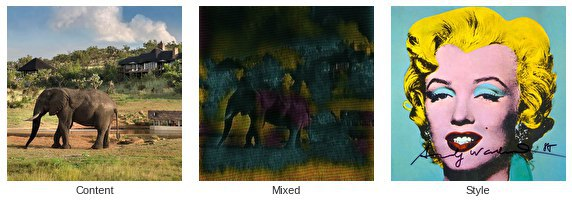
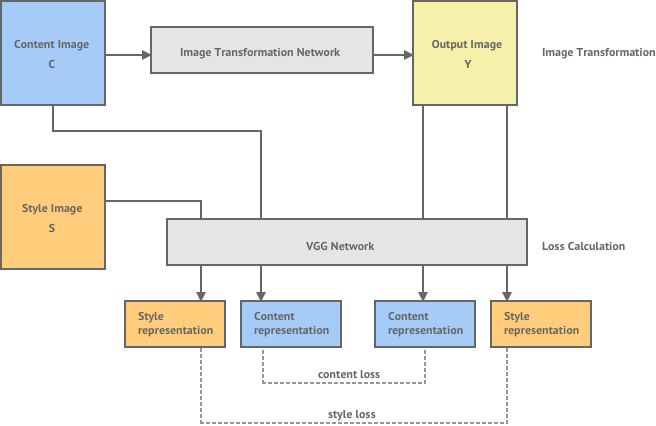
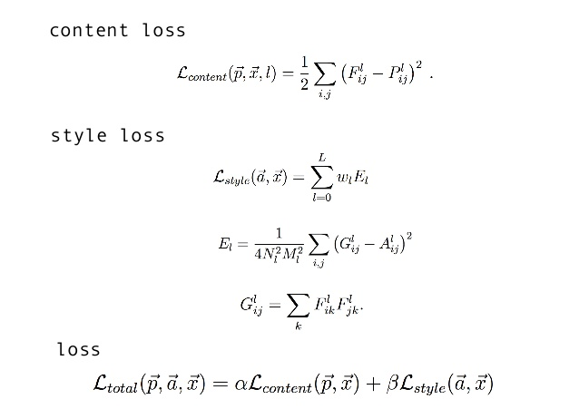

# Neural_style_transfer
An implementation of [neural style][paper] in TensorFlow.  
    
  
Presentation of [neural style][ppt].

Style transfer is the technique of recomposing images in the style of other images.
## Dependencies

    tensorflow
    matplotlib
    python 3
    
## Examples
    
    
    

## What does the paper do?
* Create artistic images of high perceptual quality.
* The key observation: the representations of content and style of an image in the Convolutional Neural Networks are separable.
* Use a pre-trained VGG-19 (average pooling) to find another image simultaneously matches the content of a photograph and the style of a piece of art work.   
   

## Loss
### Content representation and loss:
Given a chosen content layer l, the content loss is defined as the Mean Squared Error between the feature map F of our content image C and the feature map P of our generated image Y.    

When this content-loss is minimized, it means that the mixed-image has feature activation in the given layers that are very similar to the activation of the content-image.

### Style representation and loss:
If the feature map is a matrix F, then each entry is in the Gram matrix G   

The loss function for style is quite similar to out content loss, except that we calculate the Mean Squared Error for the Gram-matrices instead of the raw tensor-outputs from the layers.   

 
## Related Papers:
* A Parametric Texture Model Based on Joint Statistics of Complex Wavelet Coefficients. Portilla, J., & Simoncelli, E. P. Int. J. Comput. Vis. 40, 49-70 (2000)

* Texture Synthesis and The Controlled Generation of Natural Stimuli Using Convolutional Neural Networks. Gatys, L. A., Ecker, A. S., & Bethge, M. NIPS (2015)

* Understanding Deep Image Representations by Inverting Them. Mahendran, A., & Vedaldi, A. CVPR (2015)

[paper]: http://arxiv.org/pdf/1508.06576v2.pdf
[ppt]: https://docs.google.com/presentation/d/1Rs_saCe34Qdvh1XzIGdLpRavNaartBZHIy3VcZCDTBs/edit?usp=sharing
